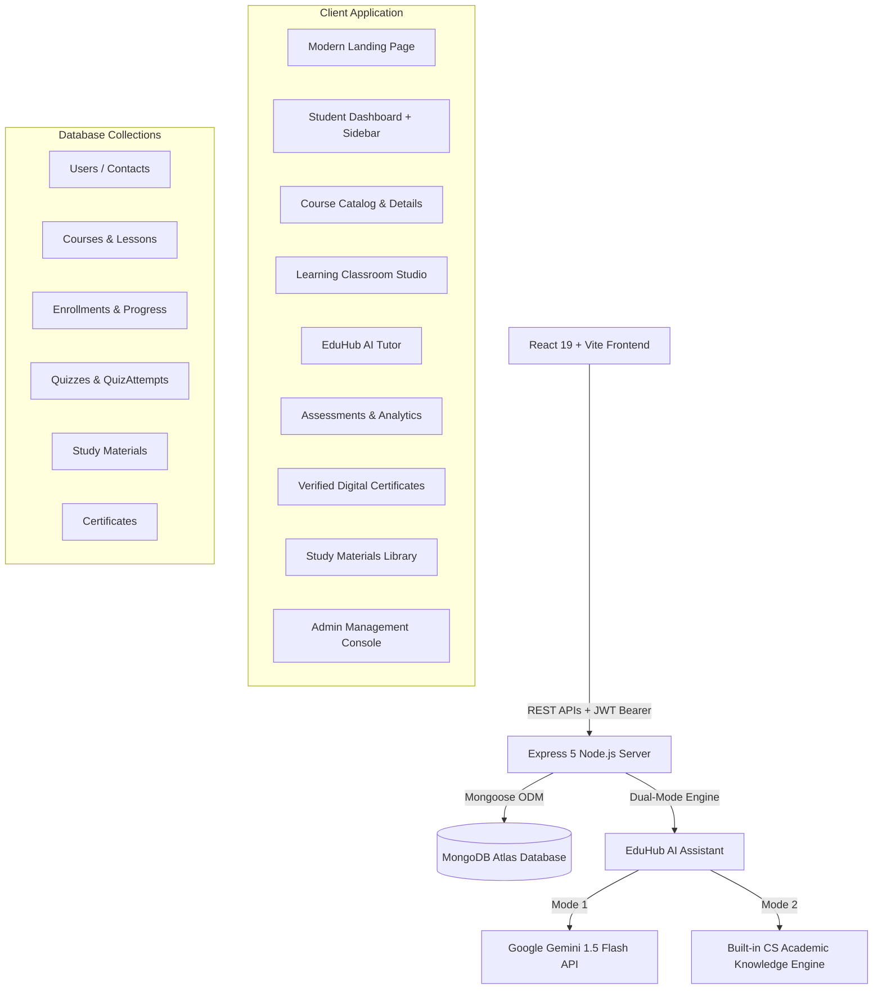

# EduHub — Learn Smarter, Track Progress, and Achieve More

[](https://react.dev)
[](https://react.dev)
[](https://expressjs.com)
[](https://www.mongodb.com)
[](https://vitejs.dev)

A modern, SaaS-grade **Full-Stack MERN EdTech & Learning Management Platform** designed for an **MCA placement portfolio**. EduHub provides end-to-end curriculum tracking, an interactive classroom studio, a 24/7 AI computer science tutor, timed MCQ placement assessments, gamified streaks & XP milestones, verifiable digital certificates, and a comprehensive admin management console.

---

## 🏛️ System Architecture



---

## 🚀 Key Modules & Feature Highlights

### 1. Modern SaaS UI/UX & Design System
- **Dark-slate EdTech Theme**: High-contrast, accessibility-compliant design with deep navy backgrounds, indigo/cyan accent gradients, and glassmorphic card borders.
- **Persistent Student & Admin Sidebar**: Instant routing between Dashboard, Courses, My Learning, AI Tutor, Quizzes, Study Materials, Certificates, Achievements, and Profile.
- **Mobile-Responsive Drawer**: Seamless drawer navigation and layout reflow across mobile, tablet, laptop, and 4K displays.
- **Reusable Component Library**: Loading skeletons, empty states, animated progress rings, status badges, and toast notifications.

### 2. Modern Landing Page
- **Hero Headline**: *"EduHub — Learn Smarter, Track Progress, and Achieve More."*
- **Live Student Preview Visual**: Showcases live learning streak (7d), XP points, and interactive course progress.
- **Popular Tracks Showcase**: Filterable tabs for Full-Stack MERN, AI & Data Science, DSA & System Design, and Cloud DevOps.
- **Value Bento Grid**: AI tutor capabilities, persistent progress, timed quizzes, and placement-ready credentials.
- **Placement Proof Counters**: 15,000+ learners, 98.4% MCA placement rate, and 4.9/5 satisfaction rating.

### 3. Authentication & Role-Based Access Control (RBAC)
- **JWT Authentication**: Secure Bearer token authentication with 7-day expiration and automated header injection via Axios interceptor.
- **Protected Routes**: `<ProtectedRoute>` guards student pages, redirecting unauthenticated users to `/login`.
- **Admin-Only Guards**: `<AdminRoute>` restricts the administrative console to users with `admin` or `instructor` roles.
- **Demo Role Switcher**: Quick-toggle pill in the header and sidebar to seamlessly demonstrate Student vs. Admin views during viva and placement interviews.

### 4. Student Dashboard
- **Personalized Greeting**: Dynamic welcome with student name, date, and motivational quotes.
- **Continue Learning Hero Card**: Displays the active course title, last completed lesson, overall progress bar, and a direct "Resume Learning" button.
- **4 Core KPI Stat Cards**: Overall Progress %, Learning Streak (days), Experience Points (XP) & Level, and Earned Certificates.
- **Enrolled Courses Grid**: Real-time progress indicators sourced from MongoDB.
- **Recommended Courses**: Smart recommendations based on career track.
- **Quiz Performance Widget**: Latest assessment score, accuracy percentage, and strong/weak topic highlights.

### 5. Course Management & Dedicated Details Page
- **Course Catalog (`/catalog`)**: Real-time debounced keyword search, category filtering, and difficulty level filtering.
- **Dedicated Course Details (`/courses/:id`)**:
  - Comprehensive course overview, instructor biography, and rating badges.
  - *"What You'll Learn"* key outcomes checklist.
  - Interactive curriculum accordion detailing every lesson title, video duration, and preview state.
  - Sticky enrollment card with free enrollment CTA and lifetime perks breakdown.
- **Enrollment System (`POST /api/enroll`)**: Automatically assigns course to the student and tracks ongoing progress in MongoDB.
- **My Learning Hub (`/my-learning`)**: Dedicated tab filtering courses by *"In Progress"* vs. *"Completed"*.

### 6. Interactive Learning Classroom Studio (`/learn/:courseId`)
- **Main Learning Area**:
  - 16:9 embedded video classroom player with lesson titles and architectural descriptions.
  - Previous / Next lesson navigation buttons.
  - **"Mark as Completed"** CTA that persists completion to MongoDB, calculates progress %, awards +50 XP, and triggers a full confetti celebration upon 100% completion!
- **Curriculum Sidebar**: Real-time checklist of completed lessons, current lesson indicator, and course progress bar.
- **Study Tab System**:
  - *Overview*: Concept summary and key takeaways.
  - *Personal Notes*: In-browser notepad with direct cloud sync to MongoDB (`/progress/save-note`).
  - *Resources*: Direct downloads for lesson PDFs, code templates, and cheat sheets.
  - *Ask AI*: Pre-populates EduHub AI with the active lesson context.

### 7. EduHub AI Assistant (`/ai-tutor`)
- **ChatGPT-Style Educational Interface**: Conversational workspace with clean Markdown rendering, syntax-highlighted code blocks, and one-click copy buttons.
- **Quick Prompt Accelerators**:
  - ⚡ *Explain this topic simply*
  - 🎯 *Generate 10 MCQs*
  - 📝 *Create revision notes*
  - 📅 *Create a 7-day study plan*
- **Dual-Mode Backend Architecture**:
  - *Mode 1 (Live)*: Connects to Google Gemini 1.5 Flash when `GEMINI_API_KEY` is configured.
  - *Mode 2 (Guaranteed Fallback)*: High-yield built-in CS/MCA academic engine covering React 19, Express, MongoDB optimization, DBMS normalization, DSA, and System Design. Never crashes or errors during demos even if offline!

### 8. Timed Quizzes & Placement Assessments (`/quizzes`)
- **Interactive Quiz Player**: Live ticking countdown timer, question palette navigator, and radio-card choice selection.
- **Comprehensive Score Report**:
  - Final Score (e.g. 8/10) and Accuracy Percentage (80%).
  - Time taken (e.g. 07:32).
  - Categorized **Strong Topics** vs. **Topics to Improve**.
  - Question-by-question review displaying the student's answer, correct answer, and in-depth technical explanation.
- **Quiz History**: Every attempt is saved to MongoDB (`QuizAttempt` model) and displayed on the student dashboard.

### 9. Gamification & Progression (`/achievements`)
- **Experience Points (XP) & Levels**: Earned dynamically by completing lessons (+50 XP) and scoring high on quizzes (+100 XP).
- **Learning Streak Counter**: Tracks active daily study streaks.
- **Badges Matrix**: Includes *"First Course Completed"*, *"7 Day Streak"*, *"Quiz Master"*, *"Learning Champion"*, and *"AI Scholar"*.

### 10. Verified Digital Certificates (`/certificates`)
- **Automatic Issuance**: Issued immediately upon reaching 100% completion on any track.
- **Official Credential Layout**: Includes EduHub emblem, student name, course title, issue date, grade (*"Distinction (O)"*), instructor signature, and immutable Certificate ID (`EDUHUB-2026-MCA-XXXX`).
- **Print & PDF Export**: Native browser print stylesheet for export to PDF or physical certificate printing.
- **Public Certificate Verification Portal**: Search bar allowing recruiters or faculty to enter any Certificate ID and verify its authenticity against the database.

### 11. Centralized Study Materials Hub (`/materials`)
- Central repository for placement guides, lecture notes, formula cheat sheets, and source code archives.
- Search and category filters (Frontend, Backend, Database, DSA, Cloud, Placement).
- Bookmark toggle saved in browser storage.
- Download button that calls `/api/materials/download/:id` to increment live download analytics.

### 12. Institutional Admin Console (`/admin`)
- **Overview Dashboard**: Live statistics for total students, active tracks, quizzes, certificates, and recent system activity logs.
- **Student User Directory**: View registered users, examine XP and streak activity, and toggle roles between student, instructor, and admin.
- **Course Publishing Suite**: Create, preview, and delete courses.
- **Study Materials Management**: Publish new resource downloads and manage categories.
- **Quizzes Oversight**: Inspect assessment questions, durations, and passing standards.
- **Manual Certificate Issuance**: Issue accredited certificates directly to candidates.

---

## 🗄️ Database Schemas & Models

| Model | File | Primary Fields |
| :--- | :--- | :--- |
| **User / Contact** | `model/contactmodel.js` | `name`, `email`, `password` (bcrypt), `role`, `xp`, `streak`, `level`, `badges` |
| **Course** | `model/coursemodel.js` | `title`, `category`, `difficulty`, `instructor`, `duration`, `rating`, `curriculum[]` (lessons, videoUrl, notes) |
| **Enrollment** | `model/enrollmentmodel.js` | `userId`, `courseId`, `completedLessons[]`, `progressPercentage`, `notes[]`, `isCompleted`, `certificateId` |
| **Quiz** | `model/quizmodel.js` | `title`, `category`, `difficulty`, `durationMinutes`, `questions[]` (text, options, correctIndex, explanation, topic) |
| **QuizAttempt** | `model/quizmodel.js` | `userId`, `quizId`, `score`, `accuracy`, `timeTakenSeconds`, `strongTopics[]`, `weakTopics[]`, `xpEarned` |
| **Material** | `model/materialmodel.js` | `title`, `category`, `type` (pdf/notes/code), `description`, `size`, `downloadsCount`, `tags[]` |
| **Certificate** | `model/certificatemodel.js` | `certificateId`, `userId`, `studentName`, `studentEmail`, `courseTitle`, `grade`, `verified` |

---

## 🛠️ Installation & Setup

### Prerequisites
- [Node.js](https://nodejs.org) (v18 or higher; tested on v24)
- [MongoDB Atlas](https://www.mongodb.com/cloud/atlas) or local MongoDB instance

### Step 1: Clone Repository
```bash
git clone https://github.com/papudas2004/EDUHUB.git
cd EDUHUB
```

### Step 2: Configure Environment Variables
Create a `.env` file in `EduHub Backend/`:
```env
MONGO_URL=your_mongodb_connection_string
PORT=8080
JWT_SECRET=your_super_secret_jwt_key
GEMINI_API_KEY=optional_gemini_api_key
```

### Step 3: Start Backend Server
```bash
cd "EduHub Backend"
npm install
npm run dev
# Server runs on http://localhost:8080
# Database automatically seeds with courses, quizzes, and materials if empty!
```

### Step 4: Start Frontend Client
```bash
cd "EduHub Frontend"
npm install
npm run dev
# Application runs on http://localhost:5173
```

---

## 🎓 MCA Placement Viva & Interview Talking Points

When presenting this project in a placement interview, highlight:

1. **Full MERN Stack Architecture**:
   - Demonstrates clean separation of concerns: Express routes delegate to controllers, interact with Mongoose models, and communicate over structured JSON REST endpoints.
2. **Security & Authentication**:
   - Passwords hashed using `bcryptjs` with salt factor 10.
   - Stateless authentication using signed JSON Web Tokens (`jsonwebtoken`).
   - Axios HTTP interceptors attach `Authorization: Bearer <token>` on all outbound requests.
   - Strict role-based route protection on both backend middleware (`verifyToken`, `restrictTo`) and React client guards (`<ProtectedRoute>`, `<AdminRoute>`).
3. **Optimized State & Progress Synchronization**:
   - Lesson completions dynamically update the `Enrollment` collection in MongoDB.
   - Automatic calculation of completion percentage and conditional generation of accredited `Certificate` records upon reaching 100%.
4. **Dual-Mode AI Architecture**:
   - Highlights thoughtful, resilient engineering: seamless integration with modern LLM APIs (Google Gemini) alongside an intelligent offline fallback engine ensuring zero downtime during demonstrations.
5. **Production UI/UX**:
   - Modern developer platform design (Vercel/Linear style), animated SVG charts, CSS design tokens, loading skeletons, and interactive confetti celebratory animations.

---

## 👨‍💻 Author
**Papu Das**  
MCA Candidate | Full-Stack MERN & Cloud Enthusiast
